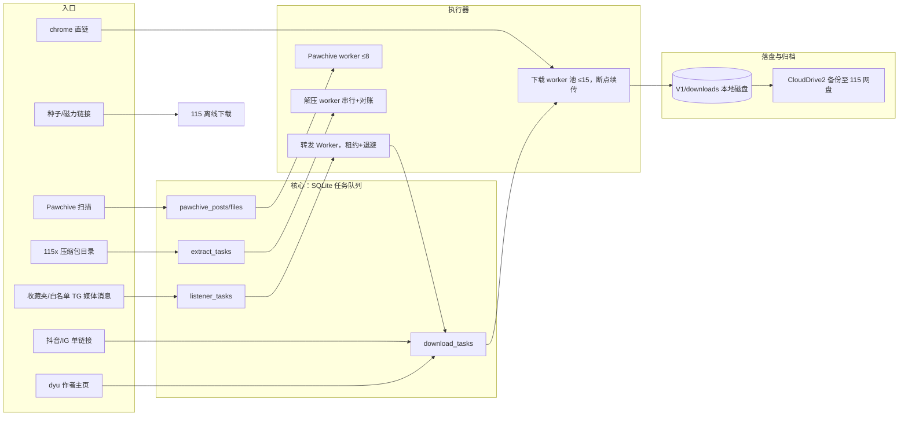
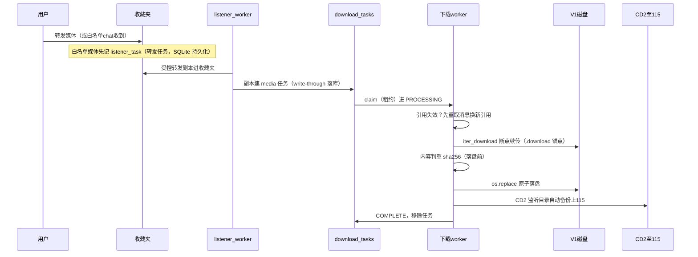
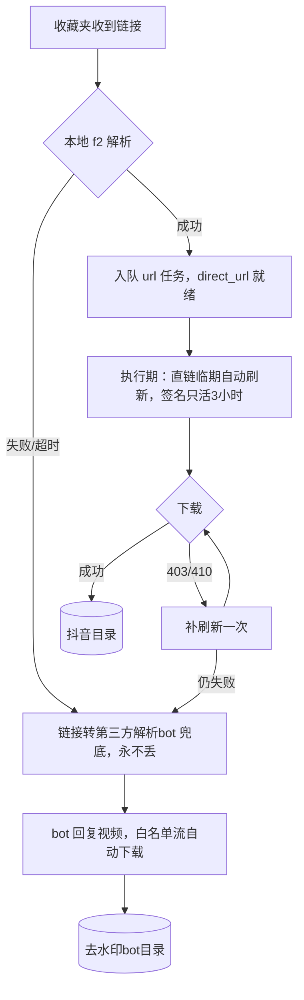
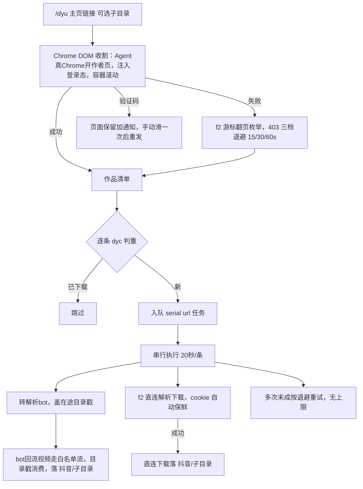
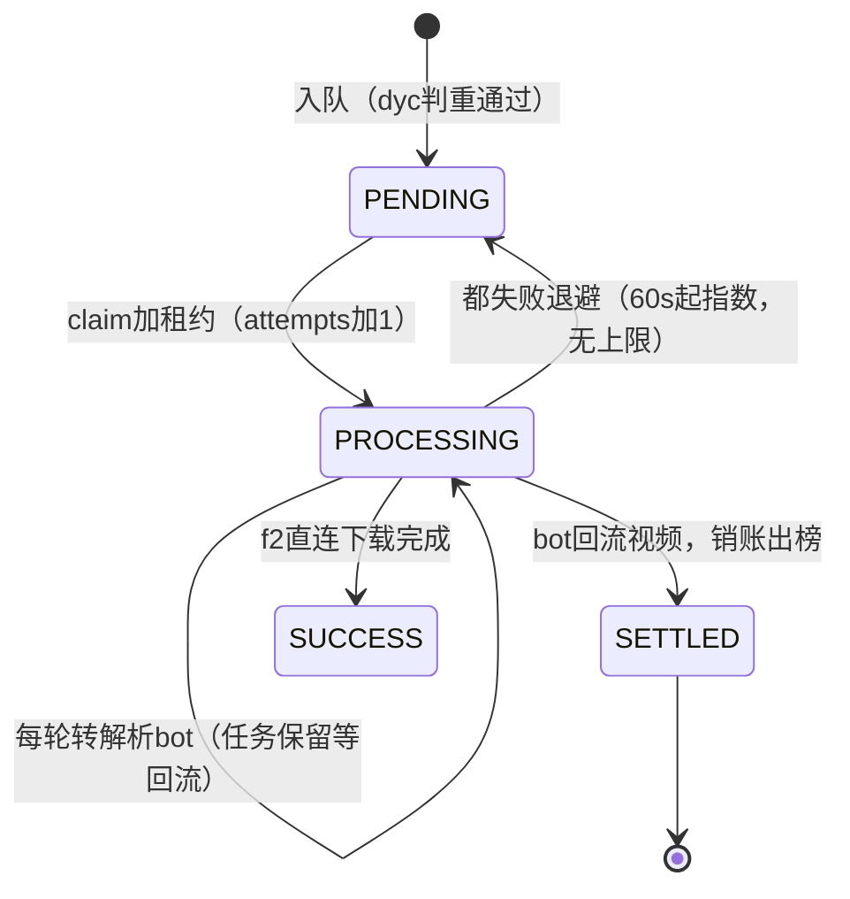
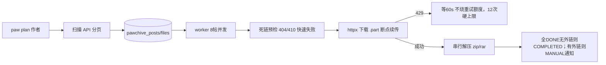
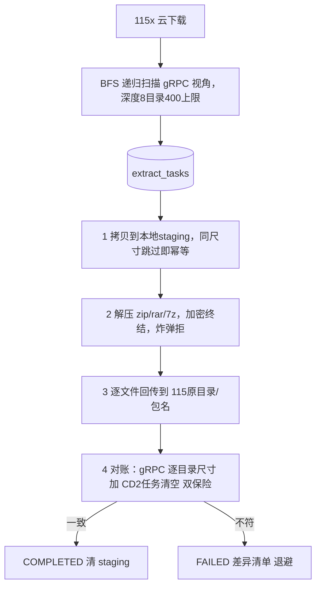
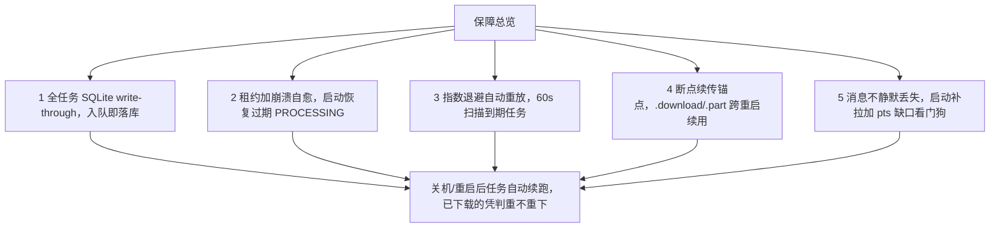
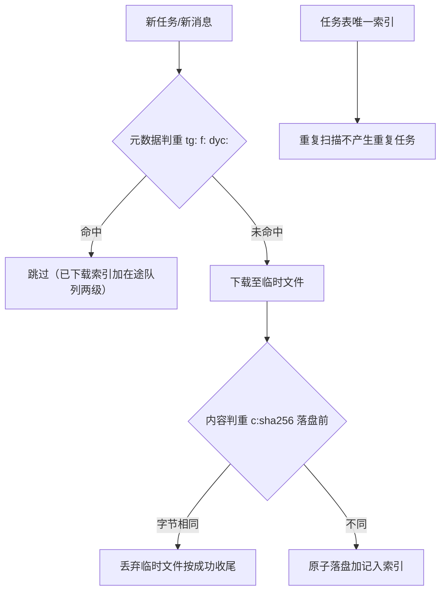

# tg_userbot 下载链路操作指引

> **版本**：v1.5（2026-10-09）｜ 适用 bot v2.10 + Runtime DB schema v12
> **获取本文档**：收藏夹发送 `/manual`，bot 会把本文件发给你
> **维护纪律**：任何下载链路的命令/机制/参数变更，**必须同步更新本文档并递增版本号**（见文末更新记录）

---

## 1. 总览：七条下载链路

| # | 链路 | 入口 | 命令 | 执行特征 |
|---|------|------|------|---------|
| 1 | TG 媒体（收藏夹+白名单+标签监听） | 转发/发送媒体 | 无（全自动）；`/queue` `/progress` 看 | worker 池 ≤15 并发，断点续传 |
| 2 | 抖音/IG 单链接 | 收藏夹发链接 | 无（全自动） | 本地 f2 解析优先，第三方 bot 兜底 |
| 3 | 抖音作者批量 | 主页链接 | `/dyu <链接> [子目录]` | **串行**，20s/条节流，解析 bot 优先 |
| 4 | Pawchive | 作者名 | `/paw plan <作者>` | ≤8 帖并发，死链预检，429 感知退避 |
| 5 | Chrome 直链 | URL | `/chrome [子目录/]URL` | Chrome Agent 浏览器下载 |
| 6 | 115 解压回传 | 115 目录 | `/115x <路径>` | 串行一次一包，回传+对账 |
| 7 | 种子/磁力 → 115 离线 | .torrent 链接/文件 | 无（全自动） | CD2 离线拉取，完成守望通知 |

---

## 2. 链路一：TG 媒体（主力链路）

### 2.1 数据流

### 2.2 关键机制

- **断点续传**：`.download` 半成品是**续传锚点**，重试/重投/重启都从断点继续；代理掐流只损失尾部。有字节推进时重试上限 3→15 次；零推进维持 3 次快速止损。
- **引用自愈**：`LocationInvalidError`/`FILE_REFERENCE_EXPIRED` 先重取消息换新引用再重试（连续 2 轮零字节或断点处连续 3 轮停滞 → 判定**媒体服务器端失效/截断**，移出队列并通知，不再无限重投）。
- **看门狗**：120s 无进度判连接僵死，取消重试。
- **半成品清理**：启动清理只动 **7 天以上**的陈旧 `.download`（新鲜锚点绝不动）。

### 2.3 命令

| 命令 | 作用 |
|------|------|
| `/queue` | 队列与待重试列表 |
| `/retry` / `/retry_all` / `/retry_del` | 重放/清空/移除待重试 |
| `/queue_del N` | 移除队列任务 |
| `/progress` | 进行中下载实时进度（含来源链接） |
| `/done` | 最近完成清单 |
| `/find <关键词>` | 按标题查一条媒体的下落 |
| `/thread N` | 调并发（1-15，每条占一条独立连接） |

---

## 3. 链路二：抖音/Instagram 单链接

- **双保险降级**：本地解析失败自动转 `@DouYintg_bot`（它在自己服务端解析，不受本地风控影响），回复的视频经白名单流自动下载——**最坏情况 = 维持日常可用**。
- **HTML 守卫**：下载流拿到 `text/html` 一律判失败重试，**绝不落盘假文件**。
- cookie 更新：`/cookie`（或 bot 菜单 ✏️ 更新）。

---

## 4. 链路三：抖音作者批量 `/dyu`

### 4.1 全流程

### 4.2 状态流转（每条作品的任务）

### 4.3 命令与注意

| 命令 | 作用 |
|------|------|
| `/dyu <链接> [子目录]` | 发起批量（子目录省略用作者昵称） |
| `/dyu <链接> since YYYY-MM-DD [子目录]` | **只要该日期之后的作品**（f2 枚举+整页早停；v1.1） |
| `/dyu <链接> all [子目录]` | **连转发的也收**（默认仅原创；v1.2） |
| `/dyu` | **进度面板**（待下载/下载中/待重试/最近完成） |

- **默认仅原创**（v1.2）：作品列表里的转发内容自动跳过（判据=作品
  author.sec_uid 是否为作者本人，实测可靠）。要连转发一起收加 `all`。
  原创/起止日期过滤都走 f2 枚举（Chrome 页面读不到这些字段）。
- **节流 20s/条**是硬约束（保护第三方 bot），87 条全量约 30 分钟转交完。
- **在途目录戳**：转交瞬间盖章，bot 回流的下一个视频落 `抖音/<子目录>/`（一次性消费，180s TTL）。偶发错位（bot 乱序回复）会把某条落进默认目录，手动移动即可。
- 触发**验证码**：bot 会把验证页留在 Chrome 窗口并通知，手动滑一次、重发命令。
- ~~msToken 保鲜~~ 已退役（v1.4）：新版抖音不再落持久 cookie，枚举主路为 Chrome 钩子收割，不依赖 msToken。

---

## 5. 链路四：Pawchive（`/paw`）

- 常用：`/paw`（状态）/ `/paw plan <作者>` / `/paw retry <id|all>`（死链不重投）/ `/paw manual`（外链清单）/ `/paw pause|resume` / `/paw csv <作者>`。
- **外链白名单**（v1.3）：帖子里的站外链接只有命中常用网盘（MEGA/
  Google Drive/百度/夸克/阿里云盘/蓝奏云/PixelDrain/GoFile 等）才记录并
  可能进人工清单；社媒/个人站等噪声链接直接丢弃——仅含噪声链接的帖子
  整体不入队。白名单在 `config.PAWCHIVE_EXT_LINK_HOSTS`，可扩。
- 缩略图追回：`/paw recoverthumbs on`（死链补低清缩略图）。
- 磁盘保护线 2GB：低于暂停 worker，`/paw resume` 恢复。

---

## 6. 链路五~七：Chrome 直链 / 115 解压回传 / 种子离线

### 6.1 `/chrome [子目录/][#标注] URL`
网盘页等浏览器才能下的直链交给 Chrome Agent（独立实例可后台）。`/chrome_tasks` 看任务（每条带 🛑 取消），`/chrome_start|stop|status` 管 Agent。

### 6.2 `/115x <115路径>`（递归含子目录）

- 回传目标 `<原目录>/<压缩包名>/` 天然防同名、防套娃。
- `.zip` 结尾的**目录**是 115 云解压残留（不是压缩包），扫描会提示跳过。
- `/115x` 裸命令看状态；`stop/start/retry id/del id`。
- `/115x watch <路径>`：**登记目录每小时自动扫新包入队**（v1.6，唯一键判重只收新的；`/115x watch` 看列表，`unwatch <路径>` 取消；登记持久化跨重启）。
- 依赖：CD2 运行中 + 挂载 `/Volumes/CloudDrive` 在线。

### 6.3 种子/磁力（全自动）
收藏夹或 bot 对话发 `.torrent` 链接/文件 → 解析 infohash → 115 离线 → **完成守望**轮询目录，新文件出现即通知（默认守望 30 分钟）。`/cd2tasks` 看离线/上传任务。

---

## 7. 数据不丢：五层保障

| 场景 | 行为 |
|------|------|
| 下载中关机 | 半成品留锚点，重启续传（不重下已完成字节） |
| 消息在停机窗口发来 | 启动 catch_up 补拉（日志「📬 启动补拉完成」） |
| 连接活着但更新流卡死 | pts 看门狗检测缺口 → 补拉 → 两次无效断开重连 |
| worker 崩溃 | 租约到期自动回 PENDING 重跑 |
| DB 暂时写失败 | 任务不推进状态，下轮重来（绝不假成功） |
| CD2 备份 | **搬移语义**：上传 115 后删本地源（本地是暂存区，115 是归档） |

## 8. 数据不重：判重体系

- 原则：**不确定就放行**（判重永不误拦，宁可重复下载一条也不丢）。
- `/dedup on|off` 可临时关闭（关闭后同内容会重复落盘，慎用）。
- 终结性任务（媒体失效/死链/需密码）**移出队列不再重投**，避免无限空转；`/paw retry` 与 `/dyu retry` 可人工重投。

## 9. 日常运维

| 命令 | 用途 |
|------|------|
| `/inspect` | 系统巡检（连接/任务/产出/失败/备份） |
| `/status` / `/progress` / `/done` | 状态/进行中/完成 |
| `/stats` | 台账汇总（今日成功/失败/去重拦截） |
| `/cd2check` / `/cd2tasks` | 115 备份 API 实对账 / CD2 任务明细 |
| `/restart` | 优雅重启（保存状态，约 30s） |
| `/manual` | **获取本文档** |
| `./run.sh start|stop|restart|status` | 服务器侧进程管理 |

### 注意事项（踩过的坑）

1. **代理是命门**：TG 全部流量走 `tg_proxy`（Hiddify）；代理劣化表现为下载反复断流、`IncompleteReadError`——换节点即可，链路自愈。
2. **抖音风控三件套**：403（msToken 过期，等冷却或刷新 Chrome）、验证码（Chrome 窗口手动滑）、游客墙（Chrome 收割自动注入登录态）。
3. **CD2 必须在跑**：`/115x`、备份、对账都依赖；掉线时相关任务退避等待，不丢。
4. **`/dyu` 大作者耗时长**：串行+20s 节流是刻意设计（保护第三方 bot），别并行。
5. **判重键清理要谨慎**：`dyc:`/`c:` 键删除后可能重复下载；只在确知污染时清。
6. **敏感信息**：cookie/token 只存 `tg_secrets.json`（gitignore），绝不入代码/日志。

## 10. 数据表速查（schema v12）

| 表 | 内容 |
|----|------|
| `download_tasks` | 队列（media/url 任务，含 /dyu 批量） |
| `listener_tasks` / `listener_checkpoints` | 标签监听/白名单转发任务与游标（同事务） |
| `pawchive_posts` / `pawchive_files` | Pawchive 帖子与文件状态机 |
| `extract_tasks` | /115x 解压回传 |
| `dedup_index` | 判重索引（tg:/f:/dyc:/c:） |
| `download_history` / `download_events` / `task_events` | 历史/事件台账（/done /stats /find 数据源） |

`/sql` 与 `/sqlt` 可自由查询这些表。

---

## 更新记录

| 版本 | 日期 | 变更 |
|------|------|------|
| v1.0 | 2026-10-02 | 初版：七链路全图、五层不丢保障、判重体系、/dyu 三顺位策略与目录戳、断点续传与终结性判定 |
| v1.1 | 2026-10-03 | /dyu 新增 since 日期参数（f2 专属路径，整页早停）；无次数上限重试+bot 回流销账；/115x staging 移出 CD2 备份树 |
| v1.2 | 2026-10-03 | /dyu 默认仅原创（author.sec_uid 判据，转发自动跳过；all 收全部）；/115x 对账分页截断误报修复、21GB 巨包拷贝短读校验与解压超时按大小放大、挂载抖动假终结 gRPC 复核 |
| v1.3 | 2026-10-04 | /paw plan 外链白名单：仅常用网盘链接（MEGA/百度/夸克/阿里云盘等，config.PAWCHIVE_EXT_LINK_HOSTS）进人工处理，噪声链接丢弃、纯噪声帖不入队 |
| v1.4 | 2026-10-04 | Argus 风控应对：抖音 10-03 夜间升级后 f2/注入 cookie/CDP Network 域全被拒；枚举主路改「Agent Chrome 页面内 fetch 钩子收割」（导航前注入、零 CDP 网络域，字段全量支持原创/since），f2 降级回落 |
| v1.5 | 2026-10-09 | /dyu 重试策略定稿（每轮 bot 优先+销账出榜+委托不受 6h 熔断）；短读 EOF 按服务器实际收尾（元数据虚高不再死循环）；/botclean 劫持与 /cd2check 死命令修复+逐命令 dispatch 钉子；队列 sqlite 成功路径不再穿透 JSON 全量写；httpx 连接池泄漏修复；CD2 菜单补回「▶️ 启动」按钮 |
| v1.6 | 2026-10-09 | /115x watch：登记目录每小时自动扫描新压缩包入队（唯一键判重只收新的，登记持久化跨重启） |
